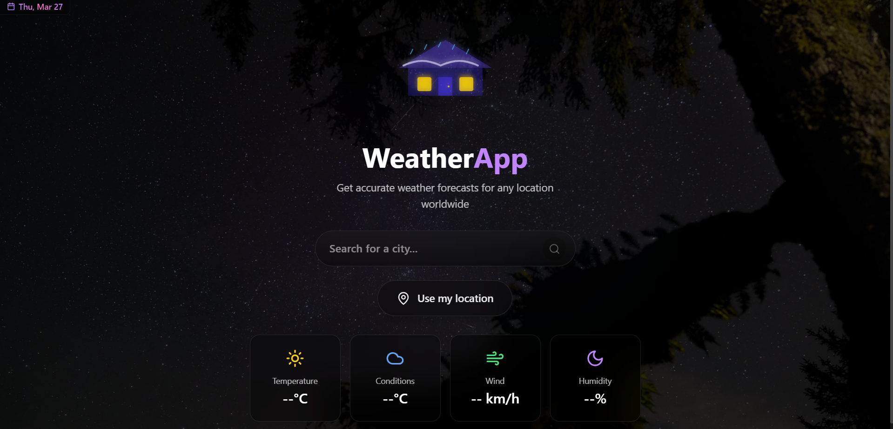

# 🌤️ Weather Forecasts

A modern, responsive weather forecast application built with React, TypeScript, and TailwindCSS.



## 🚀 Features

- Real-time weather data display
- Responsive design for all devices
- Beautiful UI with smooth animations
- TypeScript for type safety
- Modern tech stack with Vite

## 🛠️ Tech Stack


## 📦 Installation

1. Clone the repository:
```bash
git clone https://github.com/yourusername/weather-forecasts.git
```

2. Install dependencies:
```bash
cd weather-forecasts
npm install
```

3. Start the development server:
```bash
npm run dev
```

## 🚀 Available Scripts

- `npm run dev` - Start development server
- `npm run build` - Build for production
- `npm run preview` - Preview production build
- `npm run lint` - Run ESLint

## 🏗️ Project Structure

```
weather-forecasts/
├── src/               # Source files
├── public/           # Static assets
├── scripts/          # Build and utility scripts
├── weather-icons-master/  # Weather icons assets
└── ...
```

## 🤝 Contributing

Contributions are welcome! Please feel free to submit a Pull Request.

## 📝 License

This project is licensed under the MIT License - see the [LICENSE](LICENSE) file for details.

## 🙏 Acknowledgments

- Weather icons from [weather-icons](https://github.com/erikflowers/weather-icons)
- Built with [Vite](https://vitejs.dev/)
- Styled with [TailwindCSS](https://tailwindcss.com/)
- Animations powered by [Framer Motion](https://www.framer.com/motion/)

---

Made with ❤️ by [Your Name] 